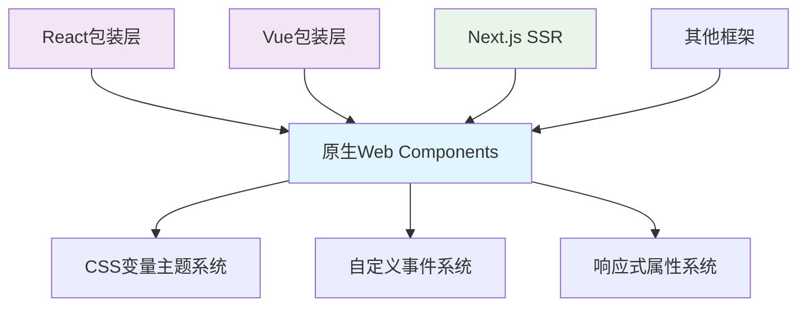

# btc-connect UI库重构实施计划

## 项目概述

**目标**：将@btc-connect/ui从基于Lit的架构重构为原生Web Components架构，实现完美的跨框架兼容性和SSR支持。

**选择方案**：
- ✅ **组件实现**：方案A - 原生Web Components（无框架依赖）
- ✅ **样式系统**：方案A - CSS变量 + 预编译CSS文件
- ✅ **框架集成**：方案A - 提供框架专用的包装组件

## 技术架构

### 新技术栈
- **核心**：原生Web Components + Shadow DOM
- **样式**：CSS变量 + 静态CSS文件
- **类型**：TypeScript严格模式
- **构建**：Vite优化配置

### 架构设计



## 实施计划

### 阶段1：基础架构搭建（2天）

#### 任务1.1：创建核心基础设施
**目标**：建立Web Components基础类和工具函数

**涉及文件**：
- `packages/ui/src/core/BaseComponent.ts` (新建)
- `packages/ui/src/core/EventEmitter.ts` (新建)
- `packages/ui/src/core/PropertyObserver.ts` (新建)
- `packages/ui/src/utils/dom.ts` (新建)

**预期结果**：
- 完整的Web Components基类
- 响应式属性系统
- 事件发射和监听机制

#### 任务1.2：实现主题系统
**目标**：基于CSS变量的主题系统

**涉及文件**：
- `packages/ui/src/styles/variables.css` (新建)
- `packages/ui/src/styles/themes/light.css` (新建)
- `packages/ui/src/styles/themes/dark.css` (新建)
- `packages/ui/src/theme/ThemeManager.ts` (新建)

**预期结果**：
- 完整的CSS变量设计令牌
- 动态主题切换功能
- SSR友好的样式加载

### 阶段2：核心组件重构（4天）

#### 任务2.1：重构ConnectButton组件
**目标**：将connect-button.ts转换为原生Web Components

**当前文件分析**：
```typescript
// 当前基于Lit的实现
@customElement('connect-button')
class ConnectButton extends LitElement {
  @property({ type: String }) label = 'Connect';
  @property({ type: Boolean }) connected = false;
  // ... 其他属性
}
```

**新的实现结构**：
```typescript
// 转换为原生Web Components
export class ConnectButton extends BaseComponent {
  static get observedAttributes() {
    return ['label', 'connected', 'balance', 'address', 'unit', 'theme'];
  }

  // 属性响应式系统
  // 渲染逻辑
  // 事件处理
}
```

**涉及文件**：
- `packages/ui/src/components/ConnectButton.ts` (重写)
- `packages/ui/src/styles/components/connect-button.css` (新建)

#### 任务2.2：重构WalletModal组件
**目标**：将wallet-modal.ts转换为原生Web Components

**涉及文件**：
- `packages/ui/src/components/WalletModal.ts` (重写)
- `packages/ui/src/styles/components/wallet-modal.css` (新建)

#### 任务2.3：创建组件注册和导出系统
**目标**：确保组件在浏览器中正确注册和可用

**涉及文件**：
- `packages/ui/src/index.ts` (重写)
- `packages/ui/src/registry.ts` (新建)

### 阶段3：框架适配层实现（2天）

#### 任务3.1：React适配层
**目标**：创建React友好的包装组件

**涉及文件**：
- `packages/react/src/components/ConnectButton.tsx` (更新)
- `packages/react/src/components/WalletModal.tsx` (更新)
- `packages/react/src/utils/web-components-react.ts` (新建)

#### 任务3.2：Vue适配层
**目标**：创建Vue友好的包装组件

**涉及文件**：
- `packages/vue/src/components/ConnectButton.vue` (新建)
- `packages/vue/src/components/WalletModal.vue` (新建)
- `packages/vue/src/utils/web-components-vue.ts` (新建)

### 阶段4：构建优化和测试（2天）

#### 任务4.1：优化Vite构建配置
**目标**：支持Web Components的构建和SSR

**涉及文件**：
- `packages/ui/vite.config.ts` (更新)
- `packages/ui/tsconfig.json` (更新)

#### 任务4.2：创建测试套件
**目标**：确保功能完整性和兼容性

**涉及文件**：
- `packages/ui/tests/components.test.ts` (新建)
- `packages/ui/tests/ssr.test.ts` (新建)
- `packages/ui/tests/react-integration.test.tsx` (新建)
- `packages/ui/tests/vue-integration.test.ts` (新建)

## 关键实现细节

### 响应式属性系统

```typescript
// BaseComponent.ts
export abstract class BaseComponent extends HTMLElement {
  protected _props: Record<string, any> = {};
  protected _observers: Map<string, Set<Function>> = new Map();

  // 属性变化监听
  attributeChangedCallback(name: string, oldValue: string, newValue: string) {
    if (oldValue !== newValue) {
      this._props[name] = this._parseAttribute(name, newValue);
      this._notifyObservers(name, newValue);
      this._scheduleRender();
    }
  }

  // 响应式属性订阅
  observeProperty(name: string, callback: Function) {
    if (!this._observers.has(name)) {
      this._observers.set(name, new Set());
    }
    this._observers.get(name)!.add(callback);
  }
}
```

### CSS变量主题系统

```css
/* variables.css */
:root {
  /* 颜色系统 */
  --btc-connect-primary: #f7931a;
  --btc-connect-primary-rgb: 247, 147, 26;
  --btc-connect-bg-primary: #ffffff;
  --btc-connect-bg-secondary: #f5f5f5;
  --btc-connect-text-primary: #333333;
  --btc-connect-text-secondary: #666666;

  /* 间距系统 */
  --btc-connect-space-xs: 4px;
  --btc-connect-space-sm: 8px;
  --btc-connect-space-md: 16px;
  --btc-connect-space-lg: 24px;

  /* 动画系统 */
  --btc-connect-duration-fast: 0.15s;
  --btc-connect-duration-normal: 0.3s;
  --btc-connect-easing: ease;
}

[data-theme="dark"] {
  --btc-connect-bg-primary: #1a1a1a;
  --btc-connect-bg-secondary: #2a2a2a;
  --btc-connect-text-primary: #ffffff;
  --btc-connect-text-secondary: #cccccc;
}
```

### React包装实现

```tsx
// ConnectButton.tsx
import React, { useRef, useEffect, forwardRef } from 'react';
import { ConnectButton as WCButton } from '@btc-connect/ui';

export interface ConnectButtonProps {
  label?: string;
  connected?: boolean;
  balance?: number;
  address?: string;
  unit?: string;
  theme?: 'light' | 'dark';
  onConnect?: (event: CustomEvent) => void;
  onDisconnect?: (event: CustomEvent) => void;
}

export const ConnectButton = forwardRef<any, ConnectButtonProps>(
  ({ onConnect, onDisconnect, ...props }, ref) => {
    const wcRef = useRef<any>(null);

    useEffect(() => {
      const element = wcRef.current;
      if (!element) return;

      if (onConnect) {
        element.addEventListener('connect', onConnect);
      }
      if (onDisconnect) {
        element.addEventListener('disconnect', onDisconnect);
      }

      return () => {
        if (onConnect) {
          element.removeEventListener('connect', onConnect);
        }
        if (onDisconnect) {
          element.removeEventListener('disconnect', onDisconnect);
        }
      };
    }, [onConnect, onDisconnect]);

    return (
      <btc-connect-button
        ref={wcRef}
        {...props}
      />
    );
  }
);
```

## SSR兼容性保证

### 服务端渲染策略

1. **Declarative Shadow DOM**：使用内置的Shadow DOM支持
2. **静态样式注入**：在构建时生成完整的CSS
3. **客户端激活**：最小化客户端JavaScript

### Next.js集成示例

```tsx
// pages/_app.tsx
import { useEffect } from 'react';
import '@btc-connect/ui/styles';

export default function App({ Component, pageProps }) {
  useEffect(() => {
    // 确保Web Components在客户端正确注册
    import('@btc-connect/ui').then(() => {
      console.log('BTC Connect UI components loaded');
    });
  }, []);

  return <Component {...pageProps} />;
}
```

## 测试策略

### 测试覆盖范围

1. **单元测试**：每个组件的核心功能
2. **集成测试**：React/Vue包装器的正确性
3. **SSR测试**：Next.js环境下的兼容性
4. **浏览器测试**：跨浏览器兼容性
5. **性能测试**：包体大小和运行时性能

### 测试目标

- **代码覆盖率**：≥90%
- **SSR成功率**：100%
- **跨框架兼容性**：完全兼容
- **性能指标**：包体减少≥20%，性能提升≥15%

## 风险缓解

### 技术风险

1. **Shadow DOM样式隔离问题**
   - 缓解：使用CSS自定义属性和:host选择器

2. **事件系统兼容性**
   - 缓解：使用CustomEvent标准API

3. **TypeScript类型推导**
   - 缓解：完整的类型声明文件

### 项目风险

1. **开发时间超期**
   - 缓解：分阶段交付，核心功能优先

2. **回归问题**
   - 缓解：全面的自动化测试

## 成功标准

1. ✅ **API完全兼容**：现有React/Vue代码无需修改
2. ✅ **SSR完美支持**：Next.js环境下零错误
3. ✅ **性能提升**：包体和性能都有改善
4. ✅ **测试覆盖**：90%+的测试覆盖率
5. ✅ **文档完整**：详细的使用和迁移文档

## 时间线

- **第1-2天**：基础架构搭建
- **第3-6天**：核心组件重构
- **第7-8天**：框架适配层实现
- **第9-10天**：构建优化和测试

**总计：10个工作日**

---

## 确认信息

请确认以下关键决策：

✅ **组件实现方案**：原生Web Components（方案A）
✅ **样式系统方案**：CSS变量 + 预编译CSS文件（方案A）
✅ **框架集成方案**：提供框架专用的包装组件（方案A）

如无异议，我们将按照此计划开始实施。