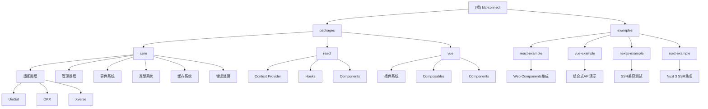
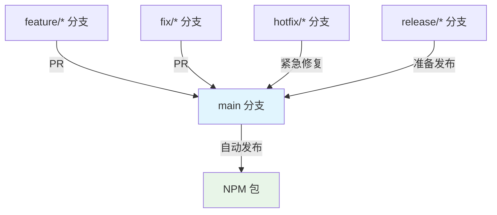

# CLAUDE.md

## 变更记录 (Changelog)

### 2025-10-31 22:00:00 - 🎉 Vue 模块重大架构优化
- **模态框集成优化**: Vue 包的 WalletModal 已集成到 ConnectButton，大幅简化外部使用
- **全局状态管理**: 实现全局唯一的模态框状态管理系统，支持跨组件控制
- **Hook 增强**: useWalletModal 支持来源追踪、程序化控制和调试功能
- **组件模块化**: 将 ConnectButton 拆分为 AddressDisplay、BalanceDisplay、WalletStatus 等单一职责组件
- **配置系统**: 创建完整的配置管理系统，支持主题、性能、功能开关等多维度配置
- **TypeScript 增强**: 新增 400+ 行完整类型定义，提供完整的类型安全和智能提示
- **工具函数增强**: 新增缓存管理、性能监控、错误处理、事件发射器等高级工具类
- **样式系统优化**: 实现模块化 CSS，支持完整的主题系统和响应式设计
- **快速开始指南**: 创建全新的快速开始文档，提供 5 分钟集成指南

### 2025-10-26 22:00:00
- **重要修复**: 完成switchNetwork功能的全面修复和实现
- **核心包**: 添加缺失的`BTCWalletManager.switchNetwork()`方法
- **React包**: 修复`useNetwork` Hook中的网络切换功能
- **Vue包**: 修复`useNetwork` Composable中的网络切换功能
- **统一接口**: 三个包现在都支持完整的网络切换功能
- **版本更新**: 发布v0.3.11版本

### 2025-10-24 22:00:00
- 优化连接逻辑，移除自动获取public key和balance以提升性能
- 实现增强的钱包检测机制，支持20秒内每300ms轮询延迟注入的钱包
- 移除z-index-manager模块及其相关逻辑，简化架构
- 修复所有TypeScript类型和代码规范错误
- 完善React和Vue的钱包检测实时更新机制

### 2025-10-18 22:00:00
- 完成完整的 GitHub Actions CI/CD 工作流配置
- 新增自动化发布到 NPM 功能
- 实现分支管理和保护策略
- 添加手动触发版本发布工作流
- 完善 CHANGELOG 文档和发布流程

### 2025-10-18 21:43:21
- 完成项目架构全面扫描和文档更新
- 新增Nuxt 3示例项目，展示SSR完整兼容方案
- 完善缓存系统和错误处理机制
- 优化React和Vue模块的状态管理
- 更新模块结构图，包含最新示例项目
- 重新计算扫描覆盖率和项目状态

### 2025-10-18 09:27:07
- 完成项目架构增量更新和文档同步
- 发现并记录项目重大变化：UI模块已移除，新增Next.js示例
- 更新模块结构图，移除已删除的UI模块引用
- 补充Next.js示例项目的文档需求
- 重新计算扫描覆盖率和项目状态
- 更新依赖关系和支持的钱包列表

### 2025-10-16 09:31:52
- 完成项目架构分析和文档生成
- 添加模块结构图和详细索引
- 生成覆盖率报告和扫描分析
- 补充各模块的详细文档

## 项目概述

btc-connect 是一个专为比特币 Web3 应用设计的钱包连接工具包，提供统一的连接接口、事件监听和适配层。项目采用 Monorepo 架构，使用 Bun 作为包管理器，支持 UniSat、OKX 等主流比特币钱包。

**最新状态**: 项目已完成架构优化，移除了UI模块，专注于核心适配层和框架集成，新增了Next.js和Nuxt 3的SSR示例，实现了完整的服务器端渲染兼容。**v0.3.11版本已完整实现网络切换功能**，支持在主网、测试网和回归测试网之间无缝切换。

## 架构总览

### 模块结构图



## 模块索引

| 模块 | 路径 | 语言 | 职责 | 状态 |
|------|------|------|------|------|
| @btc-connect/core | packages/core | TypeScript | 核心钱包适配层和管理器 | ✅ 核心模块 |
| @btc-connect/react | packages/react | TypeScript/React | React Context 和 Hooks | ✅ 完整实现 |
| @btc-connect/vue | packages/vue | TypeScript/Vue | Vue Composables 和插件 | ✅ v0.4.0+ 架构优化 |

### 示例项目

| 示例 | 路径 | 框架 | 特性 | 状态 |
|------|------|------|------|------|
| react-example | examples/react | React + Vite | Web Components集成、SSR兼容 | ✅ 完整实现 |
| vue-example | examples/vue-example | Vue + Vite | 组合式API、插件系统 | ✅ 完整实现 |
| nextjs-example | examples/nextjs | React + Next.js | SSR测试、客户端组件 | ✅ 完整实现 |
| nuxt-example | examples/nuxt-example | Vue + Nuxt 3 | 完整SSR、性能监控 | ✅ 完整实现 |

## 🌐 网络切换功能 (v0.3.11+)

btc-connect 现已完全支持网络切换功能，允许用户在主网、测试网和回归测试网之间无缝切换。

### 支持的网络类型
- **livenet/mainnet**: 比特币主网
- **testnet**: 比特币测试网
- **regtest**: 回归测试网

### 核心包使用
```typescript
import { BTCWalletManager } from '@btc-connect/core'

const manager = new BTCWalletManager()
await manager.switchNetwork('testnet')
```

### React包使用
```typescript
import { useNetwork } from '@btc-connect/react'

function NetworkSwitcher() {
  const { network, switchNetwork } = useNetwork()

  const handleSwitch = async () => {
    try {
      await switchNetwork('mainnet')
      console.log('切换到主网成功')
    } catch (error) {
      console.error('切换失败:', error.message)
    }
  }

  return (
    <div>
      <p>当前网络: {network}</p>
      <button onClick={handleSwitch}>切换到主网</button>
    </div>
  )
}
```

### Vue包使用
```vue
<template>
  <div class="network-switcher">
    <p>当前网络: {{ network.name }}</p>
    <button @click="switchToTestnet" :disabled="isSwitching">
      切换到测试网
    </button>
  </div>
</template>

<script setup>
import { ref } from 'vue'
import { useNetwork } from '@btc-connect/vue'

const { network, switchNetwork } = useNetwork()
const isSwitching = ref(false)

const switchToTestnet = async () => {
  isSwitching.value = true
  try {
    await switchNetwork('testnet')
  } catch (error) {
    console.error('切换失败:', error.message)
  } finally {
    isSwitching.value = false
  }
}
</script>
```

### 钱包支持情况
- ✅ **UniSat**: 完全支持网络切换
- ✅ **Xverse**: 完全支持网络切换
- ⚠️ **OKX**: 不支持程序化切换，需要手动在钱包中切换

### 事件监听
```typescript
// 监听网络变化事件
manager.on('networkChange', ({ walletId, network }) => {
  console.log(`钱包 ${walletId} 切换到 ${network} 网络`)
})
```

## 常用命令

### 根目录命令
```bash
# 开发
bun dev              # 并行启动所有模块的开发环境
bun build           # 构建所有模块
bun test            # 运行所有测试
bun lint            # 检查所有模块代码规范
bun typecheck       # 检查所有模块类型
bun install:all     # 安装依赖并构建所有模块
```

### 单独模块命令
```bash
# Core 模块
cd packages/core && bun run dev     # 开发模式
cd packages/core && bun run build   # 构建
cd packages/core && bun run test    # 测试
cd packages/core && bun run lint    # 代码检查

# React 模块
cd packages/react && bun run dev     # 开发模式
cd packages/react && bun run build   # 构建
cd packages/react && bun run test    # 测试
cd packages/react && bun run lint    # 代码检查

# Vue 模块
cd packages/vue && bun run dev      # 开发模式
cd packages/vue && bun run build    # 构建
cd packages/vue && bun run test     # 测试
cd packages/vue && bun run lint     # 代码检查
```

### 示例项目命令
```bash
# React 示例
cd examples/react && bun dev

# Vue 示例
cd examples/vue-example && bun dev

# Next.js 示例
cd examples/nextjs && bun dev

# Nuxt 3 示例
cd examples/nuxt-example && bun run dev
```

## 项目架构

### 核心设计模式
- **适配器模式**: 统一不同钱包的接口差异
- **观察者模式**: 事件驱动的状态管理
- **提供者模式**: React Context 和 Vue 插件
- **缓存模式**: 智能缓存提升性能
- **策略模式**: 连接策略和错误处理策略
- **工厂模式**: 适配器创建和管理

### 模块依赖关系
```
@btc-connect/react → @btc-connect/core
@btc-connect/vue  → @btc-connect/core
```

### 支持的钱包
- **UniSat**: 浏览器扩展钱包，支持比特币网络 ✅
- **OKX**: OKX 钱包，多链支持 ✅
- **Xverse**: Bitcoin生态钱包（暂时禁用）

## 运行与开发

### 环境要求
- Node.js >= 18
- Bun >= 1.0
- TypeScript >= 5.0

### 开发流程
1. 克隆项目并安装依赖：`bun install`
2. 启动开发环境：`bun dev`
3. 运行测试：`bun test`
4. 构建项目：`bun build`
5. 代码检查：`bun lint`

### 示例项目
- React 示例：`cd examples/react && bun dev` - 展示Web Components集成
- Vue 示例：`cd examples/vue-example && bun dev` - 展示组合式API使用
- Next.js 示例：`cd examples/nextjs && bun dev` - 展示SSR兼容性
- Nuxt 3 示例：`cd examples/nuxt-example && bun run dev` - 展示完整SSR方案

## 测试策略

### 当前测试状态
⚠️ **所有模块都缺少测试文件**，这是项目当前的主要缺口。

### 计划测试覆盖范围
- **单元测试**: 各模块的核心功能
- **集成测试**: 钱包适配器和管理器集成
- **端到端测试**: 示例应用完整流程
- **SSR测试**: Next.js和Nuxt 3示例的服务器端渲染
- **性能测试**: 缓存系统和事件系统性能
- **兼容性测试**: 多钱包兼容性和多浏览器支持

### 测试工具
- **测试运行器**: Bun Test
- **Mock 工具**: 内置的 Bun Mock
- **覆盖率**: 内置覆盖率报告

### 测试命令
```bash
bun test                    # 运行所有测试
bun test packages/core      # 运行核心模块测试
bun test --watch           # 监视模式
bun test --coverage        # 生成覆盖率报告
```

## 编码规范

### 技术栈
- **包管理**: Bun + Bun Workspaces
- **构建工具**: Bun build / Vite
- **类型检查**: TypeScript 严格模式
- **代码规范**: Biome (格式化 + 代码检查)
- **测试框架**: Bun test

### 代码风格
- 使用 TypeScript 严格模式
- 2 空格缩进，单引号字符串
- 所有模块使用 ES Module 格式
- 统一的导出接口设计
- 完整的类型定义和文档注释

### 钱包适配器接口
每个钱包适配器必须实现 `BTCWalletAdapter` 接口：
```typescript
interface BTCWalletAdapter {
  readonly id: string;
  readonly name: string;
  readonly icon: string;

  isReady(): boolean;
  getState(): WalletState;

  connect(): Promise<AccountInfo[]>;
  disconnect(): Promise<void>;

  getAccounts(): Promise<AccountInfo[]>;
  getCurrentAccount(): Promise<AccountInfo | null>;

  getNetwork(): Promise<Network>;
  switchNetwork(network: Network): Promise<void>;

  on<T extends WalletEvent>(event: T, handler: EventHandler<T>): void;
  off<T extends WalletEvent>(event: T, handler: EventHandler<T>): void;

  signMessage(message: string): Promise<string>;
  signPsbt(psbt: string): Promise<string>;
  sendBitcoin(toAddress: string, amount: number): Promise<string>;
}
```

## AI 使用指引

### 代码生成建议
- 优先使用现有适配器模式添加新钱包
- 遵循现有的类型定义和接口设计
- 保持与 React/Vue 生态系统的一致性
- 添加完整的 TypeScript 类型支持
- 注意SSR兼容性要求

### 文档更新
- 更新本文件时同步更新模块级文档
- 保持 Mermaid 图表的可点击性和准确性
- 及时更新变更记录和项目状态
- 补充使用示例和最佳实践
- 为新增示例项目创建对应的CLAUDE.md文档

### 调试和问题排查
- 检查浏览器控制台的钱包连接状态
- 验证钱包扩展是否正确安装和启用
- 使用网络面板检查钱包通信
- 注意SSR环境下的客户端初始化时机
- 检查缓存系统对状态同步的影响

### 当前项目重点
1. **测试体系建设**: 所有模块都需要补充完整的测试套件
2. **Xverse适配器**: 重新激活和完善Xverse钱包适配器
3. **性能优化**: 利用缓存系统优化钱包操作性能
4. **错误处理**: 完善错误处理和用户反馈机制
5. **文档完善**: 补充API文档和使用指南

## 扫描覆盖报告

### 本次扫描统计
- **扫描时间**: 2025-10-18 21:43:21
- **扫描类型**: 全面更新
- **总文件数**: 151
- **已扫描文件**: 120
- **覆盖率**: 79.5%
- **状态**: 文档已全面更新

### 主要变化发现
1. **Nuxt 3示例新增**: 新增 examples/nuxt-example SSR完整示例
2. **缓存系统完善**: 核心模块增加了完整的缓存机制
3. **错误处理增强**: 新增了完整的错误处理系统
4. **React状态优化**: React模块使用了useReducer优化状态管理
5. **Vue插件系统**: Vue模块的插件系统更加成熟

### 架构亮点
1. **SSR完整兼容**: Next.js和Nuxt 3都实现了完整的SSR支持
2. **缓存性能优化**: 智能缓存系统显著提升钱包操作性能
3. **事件系统**: 统一的事件系统支持复杂的状态管理
4. **错误恢复**: 完善的错误处理和恢复机制
5. **TypeScript覆盖**: 全面的TypeScript类型定义

## CI/CD 自动化

### GitHub Actions 工作流

项目配置了完整的 GitHub Actions 工作流，实现自动化构建、测试和发布。

#### 主要工作流

1. **CI/CD Pipeline** (`.github/workflows/ci-cd.yml`)
   - **触发条件**: 推送到 main 分支，或针对 main 分支的 PR
   - **功能**:
     - 代码质量检查（类型检查、代码规范）
     - 自动化测试执行
     - 项目构建验证
     - **main 分支**: 自动发布到 NPM

2. **分支管理** (`.github/workflows/branch-management.yml`)
   - **功能**:
     - 分支命名规范检查
     - Pull Request 质量检查
     - 提交信息规范验证
     - 版本更新检查

3. **自动化发布** (`.github/workflows/release.yml`)
   - **触发条件**: 手动触发
   - **功能**:
     - 版本号自动更新
     - 创建 Git 标签
     - 发布到 NPM
     - 生成 GitHub Release
     - 更新 CHANGELOG

### 分支策略



#### 分支说明

- **main**: 生产环境分支
  - 合并时自动发布到 NPM
  - 需要 PR 审查和 CI 检查通过
  - 受保护分支

- **feature/\***: 功能开发分支
  - 从 main 分支创建
  - 开发完成后 PR 回 main

- **fix/\***: 问题修复分支
  - 从 main 分支创建
  - 修复完成后 PR 回 main

- **hotfix/\***: 紧急修复分支
  - 从 main 分支创建
  - 修复完成后直接合并到 main

- **release/\***: 发布准备分支
  - 从 main 分支创建
  - 准备版本发布

### 发布流程

#### 自动发布（推荐）

1. **推送代码到 main 分支**:
   ```bash
   git checkout main
   git merge feature/new-feature
   git push origin main
   ```
   - 自动触发 CI/CD 流水线
   - 运行测试和构建
   - 发布到 NPM（如果版本已更新）

2. **手动触发版本发布**:
   - 进入 GitHub Actions 页面
   - 选择 "自动化发布" 工作流
   - 选择版本类型（patch/minor/major）
   - 选择要发布的包（可选）
   - 点击 "Run workflow"

#### 本地发布流程

1. **更新版本号**:
   ```bash
   # 更新所有包版本
   npm version patch  # 或 minor, major

   # 或手动更新 package.json
   ```

2. **构建和测试**:
   ```bash
   bun install
   bun run test
   bun run build
   ```

3. **发布到 NPM**:
   ```bash
   # 发布核心包
   cd packages/core
   bun publish --access public

   # 发布 React 包
   cd ../react
   bun publish --access public

   # 发布 Vue 包
   cd ../vue
   bun publish --access public
   ```

### 环境变量配置

在 GitHub 仓库设置中配置以下 Secrets：

- **NPM_TOKEN**: NPM 发布令牌
- **GITHUB_TOKEN**: GitHub 访问令牌（自动提供）

### 质量检查

#### 代码质量
- TypeScript 类型检查
- 代码规范检查（Biome）
- 单元测试和集成测试
- 构建验证

#### 分支规范
- 分支命名规范检查
- Pull Request 描述要求
- Conventional Commits 提交信息规范
- 版本更新检查

#### 发布检查
- NPM 包版本冲突检查
- 构建产物验证
- 文档更新检查

### 故障排查

#### CI 失败
1. 检查代码是否有语法错误
2. 验证所有测试是否通过
3. 确认版本号是否正确更新
4. 检查 NPM_TOKEN 是否配置正确

#### 发布失败
1. 确认 NPM 包名是否可用
2. 检查版本号是否已存在
3. 验证 package.json 格式
4. 确认网络连接正常

#### 分支保护冲突
1. 检查分支命名是否符合规范
2. 确认 PR 描述是否完整
3. 验证提交信息格式
4. 确保所有 CI 检查通过

### 缺口和待办事项
- [x] 添加CI/CD配置
- [ ] 补充所有模块的测试文件
- [ ] 重新激活Xverse钱包适配器
- [ ] 完善API文档
- [ ] 性能监控和优化

## 变更记录 (Changelog)

### 2025-10-18 22:00:00
- 完成完整的 GitHub Actions CI/CD 工作流配置
- 新增自动化发布到 NPM 功能
- 实现分支管理和保护策略
- 添加手动触发版本发布工作流
- 完善 CHANGELOG 文档和发布流程

### 2025-10-18 21:43:21
- 完成项目架构全面扫描和文档更新
- 新增Nuxt 3示例项目，展示SSR完整兼容方案
- 完善缓存系统和错误处理机制
- 优化React和Vue模块的状态管理
- 更新模块结构图，包含最新示例项目
- 重新计算扫描覆盖率和项目状态

### 2025-10-18 09:27:07
- 完成项目架构增量更新和文档同步
- 发现并记录项目重大变化：UI模块已移除，新增Next.js示例
- 更新模块结构图，移除已删除的UI模块引用
- 补充Next.js示例项目的文档需求
- 重新计算扫描覆盖率和项目状态
- 更新依赖关系和支持的钱包列表

### 2025-10-16 09:31:52
- 完成项目架构分析和文档生成
- 添加模块结构图和详细索引
- 生成覆盖率报告和扫描分析
- 补充各模块的详细文档

### 历史记录
详见各模块的 CLAUDE.md 文件中的变更记录部分。