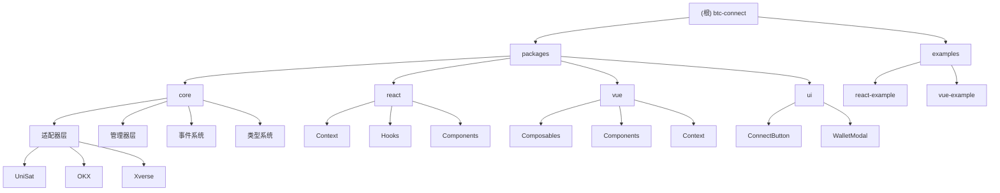

# CLAUDE.md

This file provides guidance to Claude Code (claude.ai/code) when working with code in this repository.

## 变更记录 (Changelog)

### 2025-10-16 09:31:52
- 完成项目架构分析和文档生成
- 添加模块结构图和详细索引
- 生成覆盖率报告和扫描分析
- 补充各模块的详细文档

## 项目概述

btc-connect 是一个专为比特币 Web3 应用设计的钱包连接工具包，提供统一的连接接口、事件监听和适配层。项目采用 Monorepo 架构，使用 Bun 作为包管理器，支持 UniSat、OKX、Xverse 等主流比特币钱包。

## 架构总览

### 模块结构图



## 模块索引

| 模块 | 路径 | 语言 | 职责 | 状态 |
|------|------|------|------|------|
| @btc-connect/core | packages/core | TypeScript | 核心钱包适配层和管理器 | ✅ 核心模块 |
| @btc-connect/react | packages/react | TypeScript/React | React Context 和 Hooks | ✅ 完整实现 |
| @btc-connect/vue | packages/vue | TypeScript/Vue | Vue Composables 和组件 | ✅ 完整实现 |
| @btc-connect/ui | packages/ui | TypeScript/Lit | 框架无关的UI组件 | ✅ 基础实现 |

## 常用命令

### 根目录命令
```bash
# 开发
bun dev              # 并行启动所有模块的开发环境
bun build           # 构建所有模块
bun test            # 运行所有测试
bun lint            # 检查所有模块代码规范
bun typecheck       # 检查所有模块类型
bun install:all     # 安装依赖并构建所有模块
```

### 单独模块命令
```bash
# Core 模块
cd packages/core && bun run dev     # 开发模式
cd packages/core && bun run build   # 构建
cd packages/core && bun run test    # 测试
cd packages/core && bun run lint    # 代码检查

# React 模块
cd packages/react && bun run dev     # 开发模式
cd packages/react && bun run build   # 构建
cd packages/react && bun run test    # 测试
cd packages/react && bun run lint    # 代码检查

# Vue 模块
cd packages/vue && bun run dev      # 开发模式
cd packages/vue && bun run build    # 构建
cd packages/vue && bun run test     # 测试
cd packages/vue && bun run lint     # 代码检查

# UI 模块
cd packages/ui && bun run dev       # 开发模式
cd packages/ui && bun run build     # 构建
```

## 项目架构

### 核心设计模式
- **适配器模式**: 统一不同钱包的接口差异
- **观察者模式**: 事件驱动的状态管理
- **提供者模式**: React Context 和 Vue 插件
- **组合模式**: 可复用的钱包功能组合

### 模块依赖关系
```
@btc-connect/react → @btc-connect/core
@btc-connect/vue  → @btc-connect/core
@btc-connect/ui   → @btc-connect/core
```

### 支持的钱包
- **UniSat**: 浏览器扩展钱包，支持比特币网络
- **OKX**: OKX 钱包，多链支持
- **Xverse**: Bitcoin生态钱包（开发中）

## 运行与开发

### 环境要求
- Node.js >= 18
- Bun >= 1.0
- TypeScript >= 5.0

### 开发流程
1. 克隆项目并安装依赖：`bun install`
2. 启动开发环境：`bun dev`
3. 运行测试：`bun test`
4. 构建项目：`bun build`
5. 代码检查：`bun lint`

### 示例项目
- React 示例：`cd examples/react && bun dev`
- Vue 示例：`cd examples/vue-example && bun dev`

## 测试策略

### 测试覆盖范围
- **单元测试**: 各模块的核心功能
- **集成测试**: 钱包适配器和管理器集成
- **端到端测试**: 示例应用完整流程

### 测试工具
- **测试运行器**: Bun Test
- **Mock 工具**: 内置的 Bun Mock
- **覆盖率**: 内置覆盖率报告

### 测试命令
```bash
bun test                    # 运行所有测试
bun test packages/core      # 运行核心模块测试
bun test --watch           # 监视模式
bun test --coverage        # 生成覆盖率报告
```

## 编码规范

### 技术栈
- **包管理**: Bun + Bun Workspaces
- **构建工具**: Bun build / Vite
- **类型检查**: TypeScript 严格模式
- **代码规范**: Biome (格式化 + 代码检查)
- **测试框架**: Bun test

### 代码风格
- 使用 TypeScript 严格模式
- 2 空格缩进，单引号字符串
- 所有模块使用 ES Module 格式
- 统一的导出接口设计
- 完整的类型定义和文档注释

### 钱包适配器接口
每个钱包适配器必须实现 `BTCWalletAdapter` 接口：
```typescript
interface BTCWalletAdapter {
  readonly id: string;
  readonly name: string;
  readonly icon: string;

  isReady(): boolean;
  getState(): WalletState;

  connect(): Promise<AccountInfo[]>;
  disconnect(): Promise<void>;

  getAccounts(): Promise<AccountInfo[]>;
  getCurrentAccount(): Promise<AccountInfo | null>;

  getNetwork(): Promise<Network>;
  switchNetwork(network: Network): Promise<void>;

  on(event: WalletEvent, handler: (...args: any[]) => void): void;
  off(event: WalletEvent, handler: (...args: any[]) => void): void;

  signMessage(message: string): Promise<string>;
  signPsbt(psbt: string): Promise<string>;
  sendBitcoin(toAddress: string, amount: number): Promise<string>;
}
```

## AI 使用指引

### 代码生成建议
- 优先使用现有适配器模式添加新钱包
- 遵循现有的类型定义和接口设计
- 保持与 React/Vue 生态系统的一致性
- 添加完整的 TypeScript 类型支持

### 文档更新
- 更新本文件时同步更新模块级文档
- 保持 Mermaid 图表的可点击性
- 及时更新变更记录
- 补充使用示例和最佳实践

### 调试和问题排查
- 检查浏览器控制台的钱包连接状态
- 验证钱包扩展是否正确安装和启用
- 使用网络面板检查钱包通信

## 变更记录 (Changelog)

### 2025-10-16 09:31:52
- 完成项目架构分析和文档生成
- 添加模块结构图和详细索引
- 生成覆盖率报告和扫描分析
- 补充各模块的详细文档

### 历史记录
详见各模块的 CLAUDE.md 文件中的变更记录部分。