[根目录](../../CLAUDE.md) > [packages](../) > **vue**

# @btc-connect/vue

> **Vue 3 比特币钱包连接库** - 提供完整的钱包连接、状态管理和UI组件

[](https://badge.fury.io/js/%40btc-connect%2Fvue)
[](https://vuejs.org/)

## 🎯 快速开始

### 安装

```bash
npm install @btc-connect/vue
# 或
yarn add @btc-connect/vue
# 或
bun add @btc-connect/vue
```

### 基础使用

```vue
<template>
  <div>
    <ConnectButton @connect="handleConnect" />
  </div>
</template>

<script setup>
import { ConnectButton } from '@btc-connect/vue';

const handleConnect = (walletId) => {
  console.log('Connected to:', walletId);
};
</script>
```

### 插件安装

```typescript
// main.ts
import { createApp } from 'vue';
import { BTCWalletPlugin } from '@btc-connect/vue';
import App from './App.vue';

const app = createApp(App);

app.use(BTCWalletPlugin, {
  autoConnect: true,
  theme: 'auto',
  config: {
    onStateChange: (state) => {
      console.log('Wallet state changed:', state);
    }
  }
});

app.mount('#app');
```

## 📋 变更记录 (Changelog)

### 2025-10-31 22:00:00 - 🎉 重大架构优化
- **模态框集成优化**: WalletModal 已集成到 ConnectButton 中，简化外部使用
- **全局状态管理**: 实现全局唯一的模态框状态管理
- **Hook 增强**: useWalletModal 支持来源追踪和程序化控制
- **组件模块化**: 将 ConnectButton 拆分为多个单一职责组件
- **配置系统**: 创建完整的配置管理系统，支持主题、性能等功能开关
- **TypeScript 增强**: 大幅扩展类型定义，提供完整的类型安全
- **工具函数增强**: 新增缓存管理、性能监控、错误处理等工具类
- **样式系统优化**: 实现模块化CSS，支持主题系统和响应式设计

### 2025-10-24 22:00:00
- 实现增强钱包检测：集成20秒内每300ms轮询机制
- 完善钱包检测实时更新：响应式更新可用钱包列表
- 优化自动连接逻辑：钱包检测完成后自动执行连接
- 增强页面可见性处理：页面重新可见时重新检测钱包
- 优化错误处理：增强检测失败时的回退机制

### 2025-10-16 09:31:52
- 完成 Vue 模块架构分析和文档生成
- 添加 Composables 和组件详细说明
- 补充插件系统和类型文档

## 🏗️ 模块架构

### 核心职责

@btc-connect/vue 是 btc-connect 项目的 Vue 3 适配模块，为 Vue 应用提供完整的钱包连接功能。它通过 Vue 3 的组合式 API 和插件系统，提供了：

- 🔄 **响应式状态管理** - 基于 Vue 3 的响应式系统
- 🎨 **主题系统支持** - 支持亮色/暗色/自动主题
- 📱 **移动端适配** - 完整的响应式设计
- ⚡ **性能优化** - 缓存、节流、懒加载等优化
- 🛡️ **TypeScript 支持** - 完整的类型定义和类型安全
- 🌐 **SSR 兼容** - 完整的服务器端渲染支持

### 架构设计

```mermaid
graph TD
    A["@btc-connect/vue"] --> B["Components 组件层"]
    A --> C["Composables 组合式API"]
    A --> D["Types 类型系统"]
    A --> E["Utils 工具函数"]
    A --> F["Config 配置管理"]
    A --> G["Styles 样式系统"]

    B --> H["ConnectButton (集成模态框)"]
    B --> I["WalletStatus"]
    B --> J["AddressDisplay"]
    B --> K["BalanceDisplay"]

    C --> L["useCore - 核心管理"]
    C --> M["useWallet - 钱包状态"]
    C --> N["useWalletModal - 模态框控制"]
    C --> O["useBalance - 余额管理"]
    C --> P["useNetwork - 网络管理"]

    D --> Q["组件 Props 类型"]
    D --> R["Composables 返回类型"]
    D --> S["事件类型"]
    D --> T["错误类型"]

    E --> U["格式化工具"]
    E --> V["缓存管理"]
    E --> W["性能监控"]
    E --> X["错误处理"]

    F --> Y["主题配置"]
    F --> Z["性能配置"]
    F --> AA["功能开关"]

    G --> BB["主题样式"]
    G --> CC["组件样式"]
    G --> DD["响应式样式"]
```



## 🚀 主要功能

### 1. 一键连接 (v0.4.0+)
```vue
<template>
  <ConnectButton
    theme="auto"
    size="lg"
    show-balance
    @connect="handleConnect"
  />
</template>
```

### 2. 响应式状态管理
```vue
<script setup>
import { useCore, useWallet, useBalance } from '@btc-connect/vue';

const { isConnected, currentWallet } = useCore();
const { address, publicKey } = useWallet();
const { balance, refreshBalance } = useBalance();

// 自动响应状态变化
watch(isConnected, (connected) => {
  if (connected) {
    refreshBalance();
  }
});
</script>
```

### 3. 程序化控制
```vue
<script setup>
import { useWalletModal } from '@btc-connect/vue';

const { open, close, isOpen } = useWalletModal('CustomComponent');

// 程序化打开模态框
const openWalletModal = () => {
  open('unisat'); // 可指定默认钱包
};
</script>
```

## 📦 API 参考

### 组件

#### ConnectButton
主要连接组件，已内置钱包选择模态框。

```typescript
interface ConnectButtonProps {
  size?: 'sm' | 'md' | 'lg';
  variant?: 'select' | 'button' | 'compact';
  label?: string;
  disabled?: boolean;
  theme?: 'light' | 'dark' | 'auto';
  showBalance?: boolean;
  showAddress?: boolean;
  balancePrecision?: number;
}
```

#### 子组件 (高级用法)
- `AddressDisplay` - 地址显示组件
- `BalanceDisplay` - 余额显示组件
- `WalletStatus` - 钱包状态组件

### Composables

#### useCore
核心钱包管理

```typescript
interface UseCoreReturn {
  manager: Ref<BTCWalletManager | null>;
  state: ComputedRef<WalletState>;
  isConnected: ComputedRef<boolean>;
  isConnecting: ComputedRef<boolean>;
  currentWallet: ComputedRef<WalletInfo | null>;
  availableWallets: Ref<WalletInfo[]>;
  theme: ComputedRef<ThemeMode>;
  connect: (walletId: string) => Promise<AccountInfo[]>;
  disconnect: () => Promise<void>;
  switchWallet: (walletId: string) => Promise<AccountInfo[]>;
}
```

#### useWalletModal (v0.4.0+)
全局模态框控制

```typescript
interface UseWalletModalReturn {
  isOpen: Ref<boolean>;
  theme: ComputedRef<ThemeMode>;
  open: (walletId?: string) => void;
  close: () => void;
  toggle: () => void;
  forceClose: () => void;
  currentWalletId: Ref<string | null>;
  modalSource: Ref<string | null>;
}
```

#### 其他 Composables
- `useWallet` - 账户和地址管理
- `useBalance` - 余额管理
- `useNetwork` - 网络管理
- `useSignature` - 签名功能
- `useTransactions` - 交易功能

### 插件配置

```typescript
interface BTCWalletPluginOptions {
  autoConnect?: boolean;
  connectTimeout?: number;
  theme?: ThemeMode;
  modalConfig?: ModalConfig;
  config?: WalletManagerConfig;
}
```

## 🎨 主题系统

### 支持的主题模式
- **light** - 亮色主题
- **dark** - 暗色主题
- **auto** - 跟随系统主题 (推荐)

### 主题配置

```typescript
// 全局主题配置
app.use(BTCWalletPlugin, {
  theme: 'auto',
  config: {
    theme: {
      mode: 'auto',
      followSystem: true,
      colors: {
        primary: '#f7931a',
        // 自定义主题色...
      }
    }
  }
});
```

```vue
<!-- 组件级主题覆盖 -->
<ConnectButton theme="dark" />
```

## ⚡ 性能优化

### 内置优化
- ✅ **智能缓存** - 自动缓存钱包状态和余额信息
- ✅ **状态节流** - 防止频繁的状态更新
- ✅ **懒加载** - 组件和样式按需加载
- ✅ **SSR 优化** - 完整的服务器端渲染支持

### 性能监控
```typescript
import { usePerformanceMonitor } from '@btc-connect/vue';

const { metrics, reset } = usePerformanceMonitor();

// 监控连接时间
const connectTime = metrics.value.connectionTime;
console.log('Connection time:', connectTime, 'ms');
```

## 🛠️ 工具函数

### 常用工具
```typescript
import {
  formatBTCBalance,     // BTC余额格式化
  formatAddressShort,   // 地址格式化
  copyToClipboard,      // 复制到剪贴板
  cacheManager,         // 缓存管理
  performanceMonitor,   // 性能监控
  validateAmount         // 金额验证
} from '@btc-connect/vue';
```

### 缓存使用
```typescript
import { cacheManager } from '@btc-connect/vue';

// 设置缓存（5分钟过期）
cacheManager.set('wallet-info', walletInfo, 5 * 60 * 1000);

// 获取缓存
const cached = cacheManager.get('wallet-info');

// 清理过期缓存
cacheManager.cleanup();
```

## 🔧 开发和调试

### 开发模式
```typescript
// 启用详细日志
app.use(BTCWalletPlugin, {
  config: {
    dev: {
      debug: true,
      showPerformanceMetrics: true,
      verboseLogging: true
    }
  }
});
```

### 调试工具
```typescript
import { useWalletStateMonitor } from '@btc-connect/vue';

// 监控钱包状态变化
const stopMonitor = useWalletStateMonitor((newState, prevState) => {
  console.log('State changed:', newState, prevState);
});

// 停止监控
stopMonitor();
```

## 🌐 SSR 支持

完全支持服务器端渲染，无需额外配置：

```typescript
// Nuxt 3 插件
export default defineNuxtPlugin((nuxtApp) => {
  nuxtApp.vueApp.use(BTCWalletPlugin, {
    autoConnect: true,
    theme: 'auto'
  });
});
```

```vue
<!-- 客户端组件 -->
<template>
  <ClientOnly>
    <ConnectButton />
  </ClientOnly>
</template>
```

## 📖 最佳实践

### 1. 推荐用法
```vue
<template>
  <div>
    <ConnectButton
      theme="auto"
      @connect="handleConnect"
      @error="handleError"
    />
  </div>
</template>

<script setup>
import { ConnectButton, useCore } from '@btc-connect/vue';

const { isConnected } = useCore();

const handleConnect = (walletId) => {
  console.log('Connected to:', walletId);
};

const handleError = (error) => {
  console.error('Connection error:', error);
};
</script>
```

### 2. 错误处理
```vue
<script setup>
import { useCore } from '@btc-connect/vue';

const { connect } = useCore();

const safeConnect = async (walletId: string) => {
  try {
    const accounts = await connect(walletId);
    return accounts;
  } catch (error) {
    // 处理连接错误
    console.error('Connection failed:', error);
    return null;
  }
};
</script>
```

### 3. 状态管理
```vue
<script setup>
import { computed } from 'vue';
import { useCore, useWallet } from '@btc-connect/vue';

const { isConnected, currentWallet } = useCore();
const { address } = useWallet();

// 计算属性自动响应状态变化
const walletInfo = computed(() => ({
  connected: isConnected.value,
  wallet: currentWallet.value?.name,
  address: address.value
}));
</script>
```

## 🔗 相关链接

- [Core 模块文档](../core/CLAUDE.md)
- [React 模块文档](../react/CLAUDE.md)
- [GitHub 仓库](https://github.com/IceHugh/btc-connect)
- [NPM 包](https://www.npmjs.com/package/@btc-connect/vue)
- [在线演示](https://btc-connect-demo.vercel.app)

## ❓ 常见问题

### Q: 如何自定义模态框样式？
A: 通过 CSS 变量覆盖主题样式，或使用 CSS 模块自定义。

### Q: 如何在路由切换时关闭模态框？
A: 使用 `useWalletModal().forceClose()` 方法。

### Q: 如何监听钱包事件？
A: 使用 `useCore().manager.value.on()` 方法监听事件。

### Q: 支持哪些钱包？
A: 目前支持 UniSat、OKX、Xverse 等主流比特币钱包。

---

*最后更新: 2025-10-31*